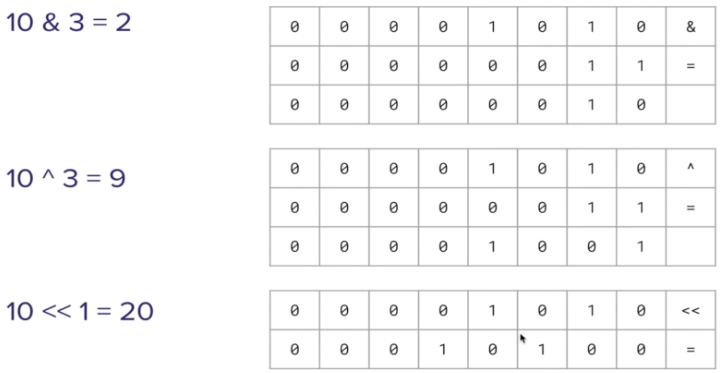

## 3. Language Basics

### 3.1 Overview
* in this section of the course, we will learn about
  * variables
  * scalar data types
  * constants
  * operators
  * functions

### 3.2 Variables
* a variable is declared with the `keyword `let`
* Rust is a strongly typed language
  ```Rust
  let name: &str = "John";
  let age: int = 28;
  ```
  * at compile-time, the compiler must know what data types are used
  * but the typing can be optional as long as the type can be inferred  
* variable names 
  * can contain letters, numbers and underscores
  * must start with a letter or underscore
  * follow *snake_case* naming convention
* variables are immutable by default and are made mutable by the keyword `mut`
* shadowing is allowed (meaning re-assignment of data to a variable)
* declaring multiple variables simultaneously is allowed
  ```Rust
  let (a, b, c) = (2, 3, 4);
  ```
* these are the basics but ownership and borrowing as well as pointer and references will be discussed later

### 3.3 Scalar Data Types
* scalar data types is synonymous with primitive data types (more on Rust data types in the [documentation](https://doc.rust-lang.org/book/ch03-02-data-types.html))

__Integers__

| Size    | Signed | Unsigned |
| ------: | -----: | -------: |
| 8 bit   | `i8`   | `u8`     |
| 16 bit  | `i16`  | `u16`    |
| __32 bit__ | `i32`  | `u32` |
| 64 bit  | `i64`  | `u64`    |
| 128 bit | `i128` | `u128`   |
| arch    | `isize`| `usize`  |

* `arch` stands for architecture of the machine and provide the native size of the machine
* __32 bit__ is the default, inferred integer size

__Floats__

| Size    | Signed | 
| ------: | -----: |
| 32 bit  | `f8`   |
| __64 bit__  | `f16`  |

* __62 bit__ is the default, inferred float size

__Number Seperators__

* the underscore `_` within numbers is a  seperators and only serves the purpose of increasing the legibility of numbers (they do not get compiled)
  ```Rust
  let million = 1_000_000;
  let random = 3_836.45_346;
  ```

__Boolean__
* booleans `bool` represent a binary state: _`true`_ or _`false`_
  ```Rust
  let is_day = true;
  let is_raining = false;
  ```

__Characters__
* here, we will look at single characters only
  * they are set with single quotes `' '`
  * their type is `char`
  ```Rust
  let a: char = 'A';
  ```
* strings of characters come in the next chapter

### 3.4 String

__String Types__
* in Rust, there are two kinds of strings: slices and objects
* slices
  * are immutable by default
  * the `static` keyword is a lifespan (for the entire runtime of the code)
  ```Rust
  let cat: &str = "Fluffy";
  // or
  let cat: &'static str = "Fluffy";
  ```
* string objects
  * can be modified
  ```Rust
  let dog = String::new();
  // or
  let dog = String::from("Rex")
  ```
* the macro `format!` can help to build strings from multiple variables

__String Operations__
* `.len()` returns the number of characters in a string
* `.push()` appends a single character to the string
* `.puhs_str()` appends a string to another string
* `.replace()` replaces one part of of string with another string
* `.split()` splits the string into sub-strings by given separator
* `.split_whitespace()` splits the string into sub-strings by whitespaces

### 3.5 Constant
* constants are variables that cannot be changed
* the are declared using the keyword `const` like this
* they are upper case by convention
* typing the data type is mandatory (it will not be infered)
* shadowing is not permitted
* they can exists in a global or a local scope
  ```Rust
  const URL: &str = "www.google.com";
  ```

### 3.6 Operators

__Arithmetic Operators__

| Operator | Name          | Example      |
| :------: | ------------- | ------------ |
| __+__    | addition      | 10 + 3 = 13  |
| __-__    | subtraction   | 10 - 3 = 7   |
| __*__    | multplication | 10 * 3 = 30  |
| __/__    | division      | 10 / 3 = 3   |
| __%__    | modulus       | 10 % 3 = 1   |

* incrementing with `+=` and decrementing with `-=` also works on mutable variables 

__Relational Operators__

| operator | name                  | example           |
| :------: | --------------------- | ----------------- |
| __>__    | greater than          | 10 > 3 ≡ true     |
| __>=__   | greater than or equal | 10 >= 3 ≡ true    |
| __<__    | less than             | 10 < 3 ≡ false    |
| __<=__   | less than or equal    | 10 <= 3 ≡ false   |
| __==__   | equal                 | 3.0 == 3.0 ≡ true |
| __!=__   | not equal             | c' != 'C' ≡ true  |

__Logical Operators__

| operator | name | example              |
| :------: | ---- | -------------------- |
| __&&__   | AND  | true && true ≡ true  |
| __\|\|__  | OR   | true \|\| false ≡ true |
| __!__     | NOT  | !true ≡ false        |

__Bitwise Operators__

| operator | name | example         |
| :-----: | ----------- | ------------ |
| __&__   | bitwise AND | 10 & 3 = 2   |
| __\|__  | bitwise OR  | 10 \| 3 = 11  |
| __^__   | bitwise XOR | 10 ^ 3 = 9   |
| __!__   | NOT         | !10 = -11    |
| __<<__  | left shift  | 10 << 1 = 20 |
| __>>__  | right shift | 10 >> 1 = 5  |

Examples of Bitwise Operations
<p align="center"></p>

### 3.7 Functions

* there is more detailed section on function (Section 7.)
* but for now, we will do the basics since using function is essential in Rust
* functions consist of
  * keyword `fn` defines function
  * a name of the function
  * round braces `()` for typing input arguments
  * `->` for typing return arguments
  * the scope / code block within curly braces `{}`  
* the `fn main()` function holds a special position; after compilation, it is what will be run by the execution of the code 
* other function are (usually) defined outside main and then called inside main
* variables can be passed into a function by
  * _value_: borrowing access to data of the variable
  * _reference_: directly accessing data of the variable
* more on this in subsequent sections