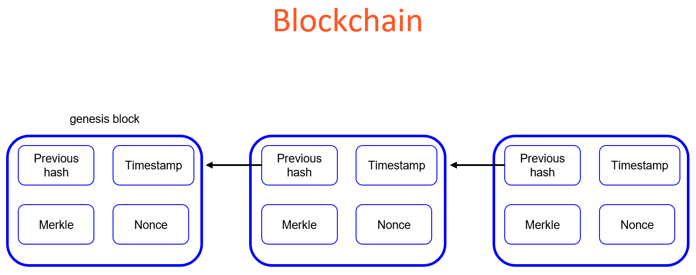
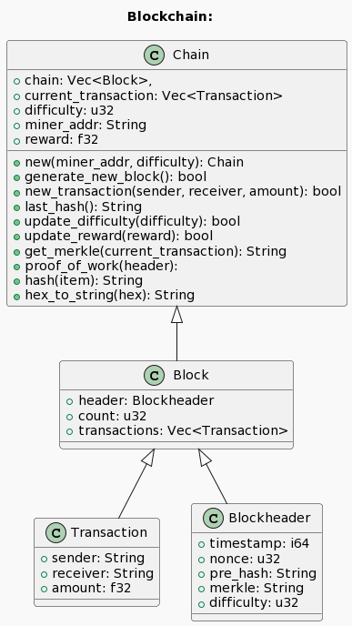

## 14. Blockchain

### 14.1 Overview
__What is a blockchain?__
* it is a linked list of blocks, where each block maintains a set of information
* the first block is called a genesis block from which the chain originate
* each following block has a hash pointing to a previous block
* other attributes of a block can include:
  * a creation timestamp
  * a nonce: performance/generation difficulty
  * a merkle:
    * instructions on how to generate a hash

__Sketch__

__Caveats__
* there limitations & differences to regular blockchain implementations and this one
* there will be
  * no distributed hosting (ledger)
  * no distributed computing
  * no special security features
  * nothing will be saved to file 

__Functionality__
* create blocks and chain them
* generate a genesis block
* run transactions on the blockchain
* generate new blocks
* adjust difficulty
* adjust reward

__Blockchain Class Diagram__

